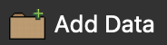
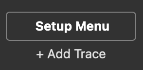
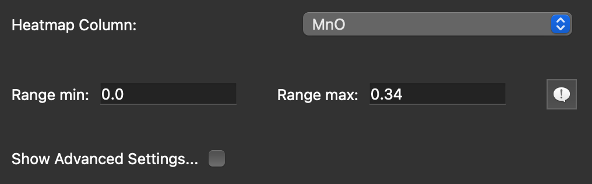
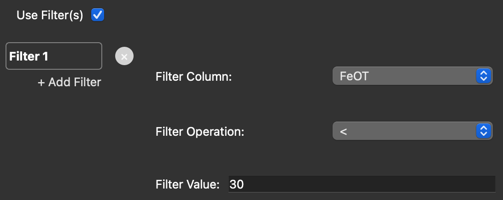
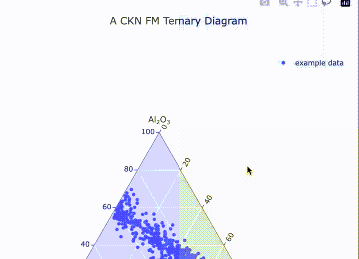

# quick-ternaries

Quick Ternaries is a python application designed to make ternary plotting a breeze. 

# Table of Contents

- [Installation](#installation)
  - [macOS](#macos)
    - [With Anaconda](#with-anaconda)
    - [Without Anaconda](#without-anaconda)
  - [Windows](#windows)
    - [With Anaconda](#with-anaconda-1)
    - [Without Anaconda](#without-anaconda-1)
- [Using Quick Ternaries](#using-quick-ternaries)
  - [Loading Data](#loading-data)
  - [Choosing a Plot Type](#choosing-a-plot-type)
  - [Configuring a Plot](#configuring-a-plot)
  - [Adding a Trace](#adding-a-trace)
    - [Configuring a Trace](#configuring-a-trace)
    - [Using a Heatmap](#using-a-heatmap)
    - [Using a Sizemap](#using-a-sizemap)
    - [Using Filters](#using-filters)
  - [Preview and Save](#preview-and-save)
  - [Plot Window Tools](#plot-window-tools)
  - [Bootstrapping](#bootstrapping)
- [New to the Terminal](#new-to-the-terminal)
  - [Opening the Terminal / Command Prompt](#opening-the-terminal--command-prompt)
  - [Running Commands](#running-commands)
  - [Navigating to a Directory](#navigating-to-a-directory)
- [Copyright and License](#copyright-and-license)
- [Contact](#contact)

# Installation

Below are installation instructions for macOS and Windows. Regardless of your operating system, we recommend following the Automatic setup instructions, and launching the tool with the provided launcher. This way, each time you boot up the tool, it will check for updates and offer to install them if any are found.

Note: This tool requires Python 3.11+.

For basic instructions on how to use the Terminal/Command Prompt, see the [New to the Terminal](#new-to-the-terminal) section.

## macOS

### Automatic

Two options exist for automatic setup on macOS: with and without Anaconda

#### With Anaconda

- Download the macOS Anaconda launcher zipfile from the [macOS Anaconda Launcher Release](https://github.com/ariessunfeld/quick-ternaries/releases/download/mac-conda-launcher/quick-ternaries-mac-conda-launcher.zip)
- Open the Finder and unzip the launcher by double-clicking the zipfile
- Right-click the file `quick-ternaries_mac_conda.command`, click `Open`, and then click `Open Anyway`
  - (After doing this once, your computer will trust the file, and you can just double-click `quick-ternaries_mac.command` to launch the app.)
- Follow the prompts in the Terminal and agree to update if asked
- **Note:** This method assumes that `conda` is a recognized command in the macOS Terminal

#### Without Anaconda

- Download the macOS launcher zipfile from the [macOS Launcher Release](https://github.com/ariessunfeld/quick-ternaries/releases/download/mac-launcher/quick-ternaries-mac-launcher.zip)
- Open the Finder and unzip the launcher by double-clicking the zipfile
- Right-click the file `quick-ternaries_mac.command`, click `Open`, and then click `Open Anyway`
  - (After doing this once, your computer will trust the file, and you can just double-click `quick-ternaries_mac.command` to launch the app.)
- Follow the prompts in the Terminal and agree to update if asked
- **Note:** This method assumes that `python3.11` is a recognized command in the macOS Terminal

### Manual

- Open the Terminal and navigate to the location where you want to install the tool
- Create a new virtual environment called `ternaries-env` (or whatever you like) by running the command `python3.11 -m venv ternaries-env`
- Activate the virtual environment by running `source ternaries-env/bin/activate`
- Update `pip` by running `pip install --upgrade pip`
- Build the `quick-ternaries` package from source by running `pip install git+https://github.com/ariessunfeld/quick-ternaries.git`
  - NOTE: If you do not have Git installed, download the latest `.whl` file from the [`dist`](https://github.com/ariessunfeld/quick-ternaries/tree/main/dist) folder in this repository and run `pip install path/to/that/file.whl`
- Launch the tool (and test installation) by running `quick-ternaries`

## Windows

### Automatic

Two options exist for automatic setup on Windows: with and without Anaconda.

#### With Anaconda

- Download the Windows Anaconda launcher zipfile from the [Windows Anaconda Launcher Release](https://github.com/ariessunfeld/quick-ternaries/releases/download/windows-conda-launcher/quick-ternaries-windows-conda-launcher.zip)
- Open the File Browser, right-click the zipfile, and unzip it by clicking Extract All
- Right-click the `quick-ternaries_windows_conda.bat` file, click `Run`, and then click `Run Anyway`
  - (After doing this once, your computer will trust the file, and you can just double-click `quick-ternaries_windows_conda.bat` to launch the app.)
  - If double-clicking doesn't work, open the Anaconda Prompt, navigate to the location of the file, and run the command `call quick-ternaries_windows_conda.bat`
- Follow the prompts in the Anaconda Prompt and agree to update if asked

#### Without Anaconda

- Download the Windows launcher zipfile from the [Windows Launcher Release](https://github.com/ariessunfeld/quick-ternaries/releases/download/windows-launcher/quick-ternaries-windows-launcher.zip)
- Open the File Browser, right-click the zipfile, and unzip it by clicking Extract All
- Right-click the `quick-ternaries_windows.bat` file, click `Run`, and then click `Run Anyway`
  - (After doing this once, your computer will trust the file, and you can just double-click `quick-ternaries_windows.bat` to launch the app.)
- Follow the prompts in the cmd prompt and agree to update if asked

### Manual

- Open the Command Prompt and navigate to the location where you want to install the tool
- Create a new virtual environment called `ternaries-env` (or whatever you like) by running the command `python3.11 -m venv ternaries-env`
- Activate the virtual environment by running `call ternaries-env\Scripts\activate.bat`
- Update `pip` by running `pip install --upgrade pip`
- Build the `quick-ternaries` package from source by running the command `pip install git+https://github.com/ariessunfeld/quick-ternaries.git`
  - NOTE: If you do not have Git installed, download the latest `.whl` file from the [`dist`](https://github.com/ariessunfeld/quick-ternaries/tree/main/dist) folder in this repository and run `pip install path\to\that\file.whl`
- Launch the tool (and test installation) by running the command `quick-ternaries`

# Using Quick Ternaries

The guide below describes each part of the Quick Ternaries tool and how to use it to create beautiful diagrams.

## Loading Data

The first step in using the Quick Ternaries tool is to load your dataset(s). 

  

Files can be `.xlsx` or `.csv` format. The tool will automatically identify the appropriate header row, so don't worry if you have a few blank rows before the column names start. (You can choose the header row if Quick Ternaries guesses incorrectly.)

## Choosing a Plot Type

After loading data, you get to select a plot type. This is where you define the axes of your ternary diagram or cartesian plot. By default, the tool be set up to plot a `Al2O3, CaO+Na2O+K2O, FeOT+MgO` ternary diagram. There a few other presets you can choose from, but if you need something not listed, you can choose to use the `Custom` type. This will display a selection interface showing the columns in your loaded data. You can select columns and then click the appropriate arrows to add columns to axes of your diagram. 

For example, if you have a column called `SiO2` in your loaded data, it will appear on the left of the selection interface. If you want `SiO2` to be on the top apex of your ternary diagram, click `SiO2`, and then click the `>>` arrow for the `Top` box. If you make a mistake, you can click the item in any box on the right side of the selection interface and then click the `<<` arrow to put it back to the left.

## Configuring a Plot

The Setup Menu lets you edit basic plot parameters:
- Plot Type (Presets or `Custom`)
- Title
- Axis Labels

You can also customize the Hover Data.
- This is the data that is visible when you hover over a point in the plot with your mouse. 
- By default, Hover Data includes the values of each axis component, as well as any columns used in Heatmaps, Sizemaps, or Filters. 

If using the `Custom` plot type, you can scale individual axis components.

Checking off `Show Advanced Settings` gives you complete control over the visual aspects of the plot. Here you can control the following features: 
- Title font and fontsize 
- Axis labels font and fontsize 
- Colorbar labels font and fontsize 
- Legend font, fontsize, bacgkround color, and border
- Paper color
- Background color
- Gridline colors
- Gridline step size
- Gridline and tickmark visibility

## Adding a Trace

The first step to plotting your data is to add a Trace.  **A Trace is a layer of data on the plot.** After adding a Trace, select a datafile from the dropdown menu. This is the data used for the Trace. 

  

- The order of layers is controlled by dragging Trace Tabs up and down. Traces closer to the Setup Menu bar get plotted first. 

### Configuring a Trace

You have complete control over the representation of each Trace. At the most basic level, you can change the name of the trace, the color, opacity, point size, and point shape.
- Changing the name will update how the Trace is displayed in the Legend.

### Using a Heatmap

Heatmaps, or continuous color scales, provide an additional dimension to the data represented in a Trace. By checking off `Use Heatmap`, you get the option to pick a numerical column from the selected datafile to represent with a color gradient. 
- Lower `Range Max` values help convey the gradient in the data  

  

By checking off `Show Advanced Settings`, you get complete control over the heatmap
- Sort data from low-to-high, high-to-low, or even shuffle it
- More than 50 different color scales to choose from
- Log-transform data to highlight the gradient in the low end
- Position the colorbar anywhere on the plot
- Modify the length, width, and orientation of the colorbar

### Using a Sizemap

Like heatmaps, sizemaps can provide an additional dimension to the data represented in a Trace. By checking off `Use Sizemap`, you get the option to pick a numerical column from the selected datafile to represent with different point sizes.
- Tip: If you want to represent categorical (i.e., non-numerical) data with a sizemap, add a column to your datafile in Excel with different numbers for each category, then select this column for the sizemap in Quick Ternaries

### Using Filters

Filters provide the most control over how data gets represented in Traces. By checking `Use Filters`, you get access to the Filter Menu. Here, filters can be added and removed. 
- Each filter applies to a single column, and filters are applies successively  

  

On categorical columns, four filter operations are available: 
- `Equals`
- `One of`
- `Exclude one`
- `Exclude multiple`  

On numerical columns, eight additional filter operations are available:
- `<`, `>`, `≤`, `≥`
- `a < x < b`, `a ≤ x < b`, `a < x ≤ b`, `a ≤ x ≤ b`

## Preview and Save

- Clicking `Preview` in the bottom left of the window will refresh the plot on the right. You can add, remove, and edit Traces without clicking `Preview`, but you will only see the changes take effect once you click the button.
- Clicking `Save` will refresh the plot and then give you the option to export the plot as a `PDF`, `PNG`, `JPEG`, or `SVG`. You can pick the filename, location, and resolution.

## Plot Window Tools

Quick Ternaries is built on the `Plotly.js` library, which features several interactive plot tools. These are available in the upper right corner of the Plot Window.

  

- Zoom: Click the Zoom tool, then click and drag on the plot to zoom in
  - Double-click anywhere on the plot to reset the zoom level
- Pan: Click the Pan tool, then click and drag on the plot to pan around when zoomed in
- Rectangle: Click the Rectangle tool, then click and drag on the plot to select the points inside a rectangular region of the plot
- Lasso: Click the Lasso tool, then click and drag on the plot to select the points inside the lasso
  - Tip: The Lasso tool can also be used to select individual points for Bootstrapping

## Bootstrapping

Clicking the `Bootstrap` button (bottom left of the window) gives you the ability to add confidence regions, or contours, to points on your ternary diagram. To use it, you must have at least one Trace already displayed on the plot.

  

- Select the `Custom` Plot Type in the Setup Menu and configure the plot apices accordingly
- Click the Lasso tool in the upper right corner of the Plot Window
- Use the mouse to lasso a **single** point
  - Tip: use the Zoom tool to make it easier to select a single point if you have a lot of data
- Click the Bootstrap button while a single point is Lasso-selected

After clicking Bootstrap, the Contour Trace Editor lets you enter uncertainties for each component of your axes
- When plotting geochemical data (e.g., LIBS data),
  - use instrument accuracy (RMSEP) to generate a contour for a geochemical standard, or to compare data across instruments
  - use instrument precision to generate contours comparing multiple points from the same instrument

- You configure the color, thickness, and opacity of each contour
- 1 sigma (68%), 2 sigma (95%), and custom-percentile confidence regions are available

# New to the Terminal

New to the Terminal / Command Prompt? No worries. 

### Opening the Terminal / Command Prompt

On macOS, to access the Terminal, the easiest way is to press Cmd+Space and type `Terminal`. A black rectangle icon should appear. Click on it, and you will launch the Terminal application (also known as `Terminal.app`).

On Windows, the terminal is called the Command Prompt. To access it, press the Windows key and type `Command Prompt`. A black rectangle icon should be among the options. Click on it, and you will launch the Command Prompt application (also known as `cmd.exe`.)

### Running Commands

When you read "Run the following command...", that means to type the command into the Terminal / Command Prompt and press the `Enter` or `Return` key. When you press `Enter` or `Return`, the Terminal / Command Prompt will execute the command.

### Navigating to a Directory

To move around different folders in the Terminal or Command Prompt, use the `cd` command. on macOS, the easiest way to get to a specific location is to open the Finder, locate the folder you want to be in, right-click the folder, then hold down the `option` key and choose `copy [foldername] as Pathname`. Then go back to the Terminal and type `cd`, then hit the `Space` bar, and then paste the pathname you copied by pressing `Cmd+V`. So, for example, if the path you copied was `/Users/yourname/Documents/someFolder/anotherFolder/`, the command would look like `cd /Users/yourname/Documents/someFolder/anotherFolder/`. 

In the Command Prompt, the process is similar. The easiest way to get to a specific folder in the Command Prompt is to open the File Browser, navigate to the desired folder, then click in the textbox at the top of the window and copy the path shown there, likely starting with `C:\...`. Then go into the Command Prompt and run the command `cd C:\...`, pasting the path you copied where the `C:\...` is.

# Copyright and License

O#: O4762  
see `LICENSE` file for OSS and MIT license details

# Contact

We would truly love to hear from you, whether you need help getting set up, have found a bug, have suggestions for changes or new features, or just want to chat! Please feel free to reach out to us via email:
- Ari Essunfeld — `ariessunfeld [at] gmail`
- Reid Morris — `reidmorris0419 [at] gmail`
